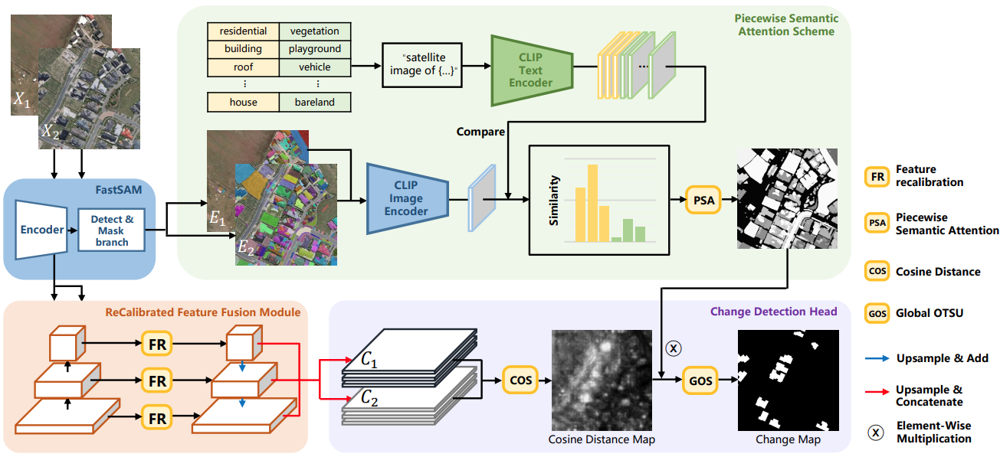
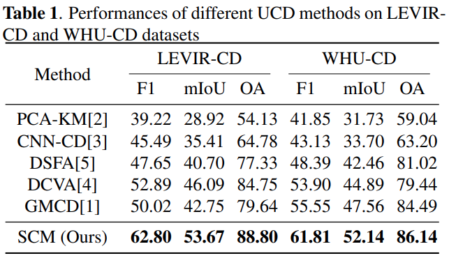
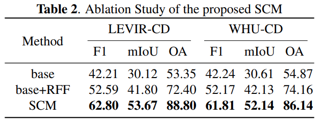
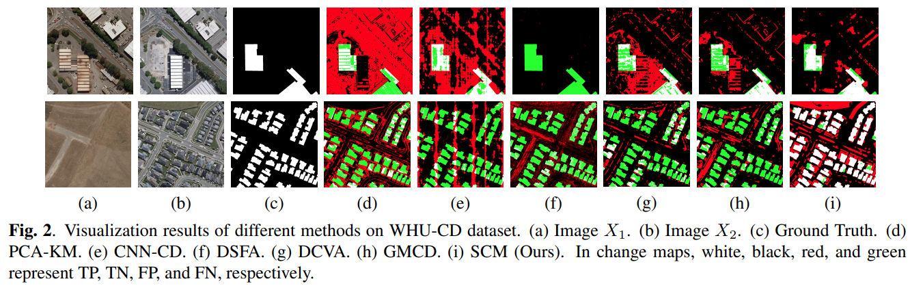

# Segment Change Model (SCM) for Unsupervised Change detection in VHR Remote Sensing Images: a Case Study of Building

Open-source codes of [CVEO](https://github.com/cveo) recent research "Segment Change Model (SCM) for Unsupervised Change detection in VHR Remote Sensing Images: a Case Study of Buildings" ([ArXiv](https://arxiv.org/abs/2312.16410), [IEEE](https://ieeexplore.ieee.org/document/10642429)), which has been recently accepted for inclusion as an **Oral** presentation in the [IGARSS 2024](https://2024.ieeeigarss.org/index.php#welcome).

To the best of our knowledge, this work is the first to apply multimodal large language models (MLLM) to remote sensing image change detection without the need for fine-tuning. This represents a preliminary exploration of the application of general AI in industry.

## Method

### Framework of Segment Change Model (SCM)



### Results on LEVIR-CD and WHU-CD datasets

#### Comparison with other UCD methods



#### Ablation Study



#### Qualitative results on WHU-CD dataset



## Usage

### Create a conda virtual env:

```shell
conda create -n scm python=3.9
conda activate SCM
```

### Installation

* Follow the instructions of installing [FastSAM](https://github.com/CASIA-IVA-Lab/FastSAM) and [CLIP](https://github.com/openai/CLIP):

```shell
git clone https://github.com/CASIA-IVA-Lab/FastSAM.git
cd FastSAM
pip install -r requirements.txt
pip install git+https://github.com/openai/CLIP.git
```

* **Copy** 'FastSAM' under 'SCM' folder.
* Download Pretrained model weights of FastSAM(FastSAM_X.pt)[[GoogleDriveLink](https://drive.google.com/file/d/1m1sjY4ihXBU1fZXdQ-Xdj-mDltW-2Rqv/view)/[BaiduDriveLink](https://pan.baidu.com/s/18KzBmOTENjByoWWR17zdiQ?from=init&pwd=0000)] and CLIP(ViT-B-32.pt)[[OpenAILink](https://openaipublic.azureedge.net/clip/models/40d365715913c9da98579312b702a82c18be219cc2a73407c4526f58eba950af/ViT-B-32.pt)] and place then in **'weights/' folder**.
* In order to generate FastSAM segmentation masks and extract featrues from FastSAM's encoder simultaneously, we modified few codes and store them in **'tbr' folder**, you need to **replace** the original codes from 'ultralytics' packages in the installed conda env:
  * replace "tbr/head.py" in "anaconda3/envs/your_conda_env_name/Lib/site-packages/ultralytics/nn/modules/head.py"
  * replace "tbr/predictor.py" in "anaconda3/envs/your_conda_env_name/Lib/site-packages/ultralytics/yolo/engine/predictor.py"
  * replace "tbr/tasks.py" in "anaconda3/envs/your_conda_env_name/Lib/site-packages/ultralytics/nn/task.py"

### Quick Start on LEVIR-CD dataset

We have prepared samples from [LEVIR-CD](https://justchenhao.github.io/LEVIR/) dataset in the 'data/samples_LEVIR' folder for a quick start.

Run like:

```shell
python demo_LEVIR.py
```

Soon you'll acquire cd results in 'results/samples_levir/'.

### Quick Start on WHU-CD dataset

We have prepared samples from [WHU-CD](https://study.rsgis.whu.edu.cn/pages/download/building_dataset.html) dataset in the 'data/samples_WHU-CD' folder for a quick start.

Run like:

```shell
python demo_WHU.py
```

Soon you'll acquire cd results in 'results/samples_WHU-CD/'.

### Contents of Directory

* data/: sample/input data dir.
  * samples_LEVIR/
  * samples_WHU-CD
* docs/
* FastSAM/: FastSAM scripts.
* results/: out UCD result dir.
* tbr/: modified codes of FastSAM.
* weights/: dir to place pretrained FastSAM and CLIP weights.

### List of Arguments

python SCM.py (for SCM model)


| Argument           | Details                                                                                                                                   |
| -------------------- | ------------------------------------------------------------------------------------------------------------------------------------------- |
| -m, --mode         | Choose modes of conducting UCD with 'RFF' (Recalibrated Feature Fusion) / 'PSA' (Piecewise Semantic Attention) modules. Default: RFF PSA. |
| --sam_weight_path  | Specify path of the FastSAM pt model. Default: 'weights/FastSAM_X.pt'.                                                                    |
| --clip_weight_path | Specify path of the CLIP pt model. Default: 'weights/ViT-B-32.pt'                                                                         |
| --img_dir_1        | Set input dir of images at prev time. Default: 'data/samples_WHU-CD/prev/'                                                                |
| --img_dir_2        | Set input dir of images at curr time. Default: 'data/samples_WHU-CD/curr/'                                                                |
| -o, --out_dir      | Set output CD directory, which consists of bcd_map and dis folders. Default: 'results/samples_WHU-CD/'                                    |

Run full script like:

```shell
python SCM.py -m RFF PSA --sam_weight_path weights/FastSAM_X.pt --clip_weight_path weights/ViT-B-32.pt --img_dir_1 data/samples_WHU-CD/prev/ --img_dir_2 data/samples_WHU-CD/curr/ -o results/samples_WHU-CD/
```

## Citation

Please consider citing the following paper if you used this project in your research.

```shell
@article{tan2023segment,
  title={Segment Change Model (SCM) for Unsupervised Change detection in VHR Remote Sensing Images: a Case Study of Buildings},
  author={Tan, Xiaoliang and Chen, Guanzhou and Wang, Tong and Wang, Jiaqi and Zhang, Xiaodong},
  journal={arXiv preprint arXiv:2312.16410},
  year={2023}
}
```

### License

Code is released for non-commercial and research purposes **ONLY**. For commercial purposes, please contact the authors.

### Reference

Appreciate the work from the following repositories:

* FastSAM: [https://github.com/CASIA-IVA-Lab/FastSAM](https://github.com/CASIA-IVA-Lab/FastSAM)
* CLIP: [https://github.com/openai/CLIP](https://github.com/openai/CLIP)
* SAM-CD: [https://github.com/ggsDing/SAM-CD](https://github.com/ggsDing/SAM-CD)
* OBIC-GCN：[https://github.com/CVEO/OBIC-GCN](https://github.com/CVEO/OBIC-GCN)
* Unsupervised-OBIC-Pytorch: [https://github.com/CVEO/Unsupervised-OBIC-Pytorch](https://github.com/CVEO/Unsupervised-OBIC-Pytorch)
